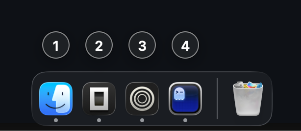

# dock-numbers

Hold **Option** to overlay numbered glass badges on your macOS Dock icons, then press a number to switch to that app — a minimal, keyboard-first app switcher.



## How it works

1. Hold **Option** — frosted number badges appear beside each running app's Dock icon (100 ms delay, so quick `Option+letter` combos stay clean).
2. Press **1–9**, **0** (0 = 10th app) — the matching app activates, or hides if it's already frontmost.
3. Release **Option** — badges disappear.

Badge placement follows the Dock automatically (left / right / bottom) based on icon geometry.

Under the hood: Dock icon positions come from the Accessibility API (`AXDockItem` elements of the Dock process), key interception via `CGEventTap`, badges are borderless `NSPanel`s with `NSVisualEffectView`.

## Requirements

- macOS 14+
- Swift toolchain (`xcode-select --install` is enough; full Xcode not required)
- **Accessibility permission**: the app needs it to read Dock icon positions and listen for the Option key. Grant it in `System Settings → Privacy & Security → Accessibility` for your terminal (or the built binary) on first run.

## Build

```sh
swift build
```

## Install a released version

1. Download `dock-numbers-macos-arm64.dmg` from the [Releases page](https://github.com/kovacsgellert/dock-numbers/releases), open it, and drag **dock-numbers** into **Applications**. (Prefer a guided install? Use `dock-numbers-installer.pkg` instead — it puts the app into `/Applications` automatically.)
2. Neither is notarized, so on first launch right-click the app and choose **Open** (otherwise Gatekeeper refuses to start it).
3. Grant Accessibility permission when prompted (`System Settings → Privacy & Security → Accessibility`).
4. A settings window opens on first launch: toggle **Start automatically when you log in** if you want it always running. The window can be reopened anytime from the menu-bar icon.

Releases are built automatically: pushing a version tag like `0.1.0` triggers the `Release` workflow, which packages the `.app`, builds the DMG, and attaches it to the GitHub Release.


## Usage

List running Dock apps and their badge numbers:

```sh
swift run dock-numbers --list
```

Activate an app by number (same as pressing it while holding Option):

```sh
swift run dock-numbers --activate 2
```

Run the daemon (hold Option to badge, press a number to switch, `Ctrl+C` to quit):

```sh
swift run dock-numbers --daemon
```

## AI disclosure

This app is completely vibe-coded — designed and written with an AI coding assistant, no hand-written code.

## License

MIT — see [LICENSE](LICENSE).

